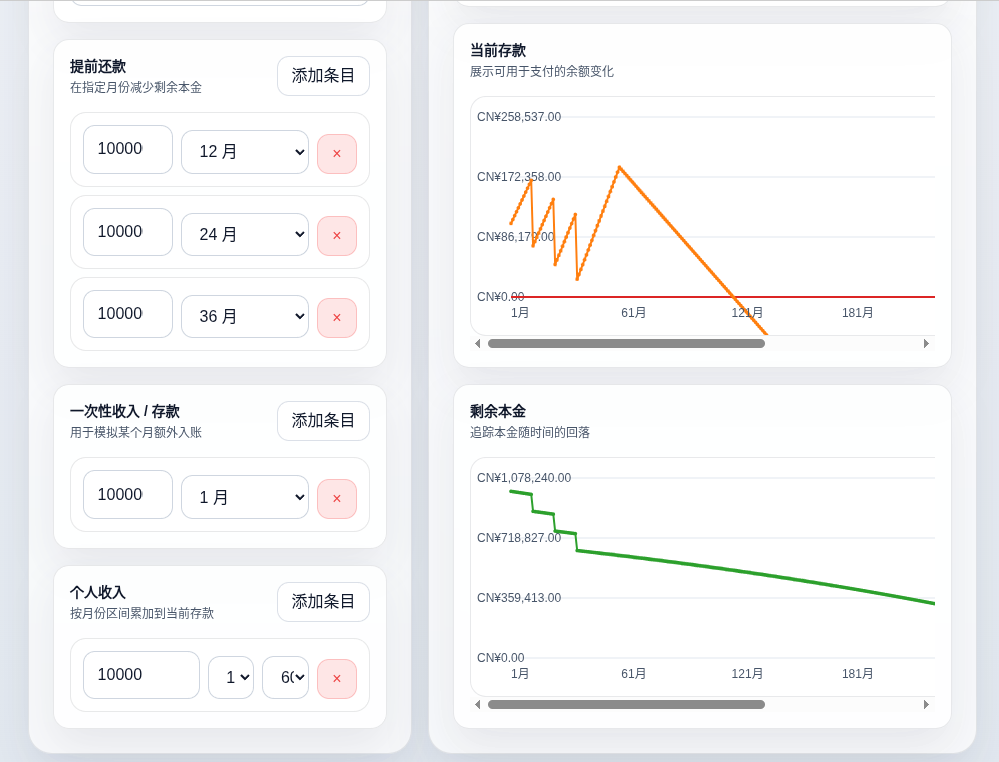
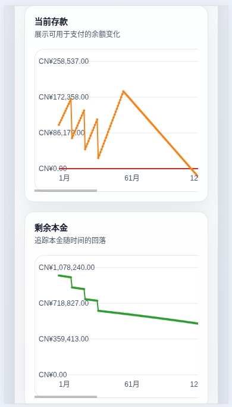

# 贷款计算器 — 输入说明

本文档列出本小应用的所有用户输入项、类型、默认值、UI 控件与约束，便于理解或扩展。

## 应用预览

桌面端预览：

移动端预览：

相关源码（快速跳转）：
- [`src/App.tsx`](apps/loan-calculator/src/App.tsx:1)
- [`src/utils.ts`](apps/loan-calculator/src/utils.ts:1)
- [`src/components/inputs/BasicInputs.tsx`](apps/loan-calculator/src/components/inputs/BasicInputs.tsx:1)
- [`src/components/inputs/Prepayments.tsx`](apps/loan-calculator/src/components/inputs/Prepayments.tsx:1)
- [`src/components/inputs/DepositsList.tsx`](apps/loan-calculator/src/components/inputs/DepositsList.tsx:1)
- [`src/components/inputs/IncomesList.tsx`](apps/loan-calculator/src/components/inputs/IncomesList.tsx:1)

## 概览
主要输入用于生成还款计划（schedule），核心计算函数：`generateSchedule(principal, months, annualRate, method, prepayments, personalDeposits)`，见 [`src/utils.ts`](apps/loan-calculator/src/utils.ts:1)。

## 输入清单
- principal（贷款金额，number）
  - 默认示例：997940.99（在 [`src/App.tsx`](apps/loan-calculator/src/App.tsx:1) 中初始化）
  - UI：number input（[`BasicInputs`](apps/loan-calculator/src/components/inputs/BasicInputs.tsx:1)）
  - 约束：非负（输入处理使用 Number(...) || 0）

- months（贷款期限，number，单位：月）
  - 默认示例：289
  - UI：number input（最小值 1）
  - 约束：最小 1（见 onChange 使用 Math.max(1, ...)），同时组件会在 months 变更时把有关月份值限定到 [1, months]

- annualRate（年利率，number，%）
  - 默认示例：3.3
  - UI：number input，step 0.01
  - 在计算中转换为月利率 r = annualRate / 12 / 100

- method（还款方式，枚举）
  - 可取值："annuity"（等额本息）或 "equal_principal"（等额本金）
  - 默认："annuity"
  - UI：select（[`BasicInputs`](apps/loan-calculator/src/components/inputs/BasicInputs.tsx:1)）

- 提前还款（prepayments，至多 3 次）
  - 字段：pre1Amount, pre1Month, pre2Amount, pre2Month, pre3Amount, pre3Month
  - 每项为：{ month: number, amount: number }（在 App 中通过 useMemo 汇总为 prepayments 数组）
  - UI：每次为一个 number 输入（amount）和一个 month 下拉（monthOptions），见 [`Prepayments`](apps/loan-calculator/src/components/inputs/Prepayments.tsx:1)
  - 约束：amount >= 0，max 属性设置为 principal；month 会被约束在 1..months
  - 在计算中会过滤掉 amount <= 0 或 month 不在区间内的条目

- 当前存款（personalDeposits，列表）
  - 类型：PersonalDeposit[]，每项 { id?: string, month: number, amount: number }
  - UI：可添加/删除条目，界面为 month 下拉 + amount 输入，见 [`DepositsList`](apps/loan-calculator/src/components/inputs/DepositsList.tsx:1)
  - 约束：仅使用 amount > 0 且 month 在 1..months 的条目；在内部转换为 Map<month, amount> 用于每月记录

- 个人收入条目（incomes，列表）
  - 类型：IncomeEntry[]，每项 { id: string, monthly: number, startMonth: number, endMonth: number }
  - UI：可添加/删除多条，字段包括月收入、起始月、终止月，见 [`IncomesList`](apps/loan-calculator/src/components/inputs/IncomesList.tsx:1)
  - 约束：startMonth 与 endMonth 在 1..months 范围内（在 App 的 useEffect 中被修正）

## 衍生/内部行为要点
- monthOptions 在 App 中基于 months 生成：Array.from({ length: months }, (_, i) => i + 1)
- prepayments 会在传入计算前过滤并排序（只保留 amount>0 且 month 在区间内的项）
- personalDeposits 会被映射为 Map<month, amount>，并在生成 schedule 时作为每月的 personalDeposit 值返回
- generateSchedule 中处理了利率为 0 的情况；对等额本息与等额本金的计算方式分别处理；提前还款会在当月的计划支付后直接从剩余本金中扣减
- 当贷款提前还清时，函数会填充剩余月份为 payment:0 的空行，保证返回数组长度为 months

## 备注（扩展点）
- 若需增加更多预付款条目，可扩展 Prepayments 组件与对应的 state 聚合逻辑
- 若要在 schedule 中使用 incomes 的信息（当前实现未将 incomes 用于贷款计算），应在 generateSchedule 前在 App 层合并/应用这些收入规则

----
文档结束。